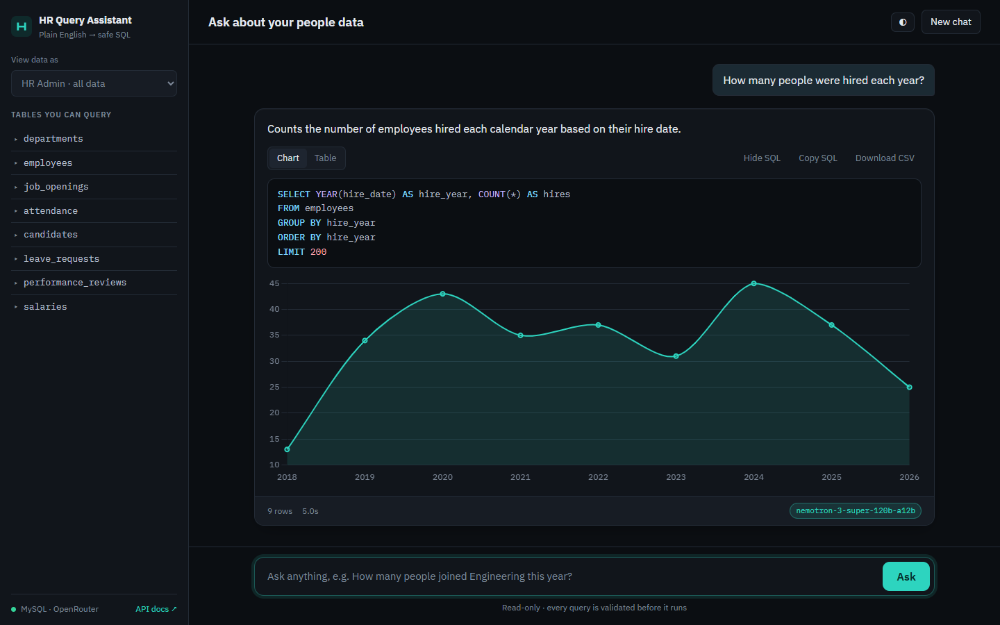
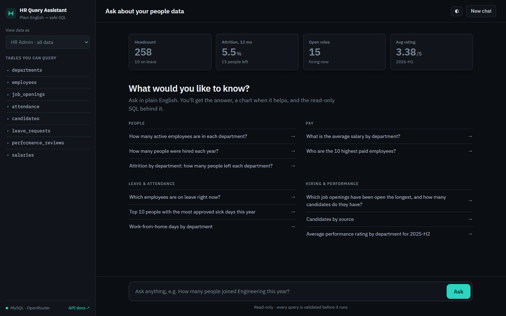
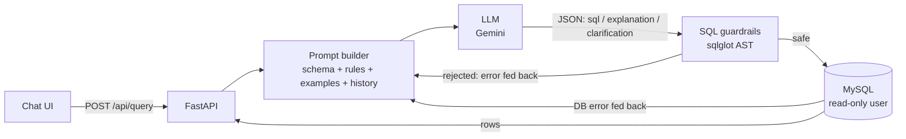

# HR NL-to-SQL Assistant



<details>
<summary>Home screen: live KPIs and grouped starter questions</summary>



</details>

Ask HR questions in plain English ("How many people left Sales this year?") and get a
safe, read-only SQL query, the results, and a short explanation. It supports follow-up
questions, asks for clarification when a question is ambiguous, and restricts sensitive
data by role.

**Stack:** Python · FastAPI · MySQL 8 · SQLAlchemy · Google Gemini · sqlglot · vanilla JS



## What you see

- **Live KPI strip:** headcount, 12-month attrition, open roles and average rating, straight from the database (no LLM).
- **Auto charts:** answers with a label and 1-3 numeric columns render as a bar or line chart (time-like labels become lines), with a Chart/Table toggle.
- **Answer cards:** plain-English explanation, syntax-highlighted SQL with Copy, CSV download, latency and the model that answered.
- **Grouped starter questions** (People, Pay, Leave & attendance, Hiring & performance); groups a role can't access are hidden.
- Dark-first design with a light theme toggle; works on mobile.

## How it works

1. **Schema context.** Every prompt includes the tables, types, keys, foreign keys,
   column comments and the *real values* of category columns (for example
   `status: 'Active', 'On Leave', 'Terminated'`), read from the database at startup.
   Business rules are stated explicitly: "current employees" means
   `status <> 'Terminated'`, and "current salary" means `effective_to IS NULL`.
2. **Structured output.** The model returns JSON: `sql`, `explanation`, or a
   `clarification` question when the request is ambiguous.
3. **Guardrails.** The SQL is parsed into an AST with sqlglot. A query is rejected if it:
   - has more than one statement
   - is not a SELECT
   - contains any write, DDL or lock node, or `INTO OUTFILE`
   - calls SLEEP, BENCHMARK, LOAD_FILE and similar functions
   - references a table outside the allowlist, or a table the user's role can't see
     (for example `salaries` for managers)

   It also forces a row `LIMIT`.
4. **Self-repair.** If validation or the database rejects the query, the error is sent
   back to the model, which gets up to 2 correction attempts.
5. **Defence in depth.** The app connects as a MySQL user with only `SELECT` grants.
   Every query runs with a server-side `MAX_EXECUTION_TIME`, and its transaction is always
   rolled back.
6. **Provider-agnostic LLM layer.** `LLM_PROVIDER=gemini|openrouter` picks the service. Both share
   one failover policy: retry overloaded models, skip rate-limited ones, prefer whichever model
   last answered, and enforce a total time budget per question.
7. **Conversation.** The client sends the last few question/SQL pairs, so follow-ups like
   "only the women" or "what about Sales?" work. The server stays stateless.

## Setup (Windows)

```bash
python -m venv .venv
.venv\Scripts\pip install -r requirements.txt
copy .env.example .env      # then fill in GEMINI_API_KEY and the two MySQL passwords
.venv\Scripts\python -m scripts.setup_mysql
.venv\Scripts\python -m uvicorn app.main:app --reload
```

Open http://localhost:8000 for the chat UI, or http://localhost:8000/docs for the REST API.

`setup_mysql` creates the `hr_assistant` database and the read-only `hr_readonly` user,
then fills the database with reproducible demo data. That's 300 employees across
8 departments with salary history, leave, attendance, performance reviews and
recruitment, about 16k rows in total. With no MySQL passwords set, the app falls back
to SQLite (`python -m scripts.seed`).

## REST API

| Method | Path | Purpose |
|---|---|---|
| `POST` | `/api/query` | `{question, role, history}` → SQL, columns, rows, explanation |
| `GET` | `/api/schema?role=` | Tables and columns visible to a role |
| `GET` | `/api/roles` | Roles and their restricted tables |
| `GET` | `/api/examples` | Sample questions |
| `GET` | `/api/health` | Database dialect and model |

## Evaluation

`eval/questions.json` holds 55 HR questions with hand-written gold SQL, covering
headcount, compensation, hiring, attrition, org structure, leave, attendance,
performance and recruitment. The runner checks **execution accuracy**: the predicted
query's results must match the gold results. Row order, column order and extra
columns are ignored.

```bash
.venv\Scripts\python -m eval.run_eval --compare
```

`--compare` runs the same questions twice: once with full schema context and once with
only table and column names. The difference measures how much the schema context helps.

## Tests

```bash
.venv\Scripts\python -m pytest
```

44 offline tests cover the guardrails, the pipeline and the API. They use a fake LLM and
a temporary SQLite database. They check that injection attempts, writes, multiple
statements, restricted tables and dangerous functions are rejected; that self-repair,
clarification and follow-up questions work; and that the role restrictions hold.

## Project layout

```
app/
  main.py      FastAPI routes + static UI
  service.py   pipeline: prompt → LLM → validate → execute → repair
  prompts.py   system prompt, few-shot examples, follow-up/repair prompts
  safety.py    sqlglot-based SQL guardrails
  db.py        engine, schema context, guarded execution
  llm.py       LLM client interface + Gemini implementation
  models.py    HR schema (SQLAlchemy)
scripts/       MySQL setup and demo-data seeding
eval/          gold questions + accuracy runner
static/        chat UI (HTML/CSS/JS)
tests/         pytest suite
```
